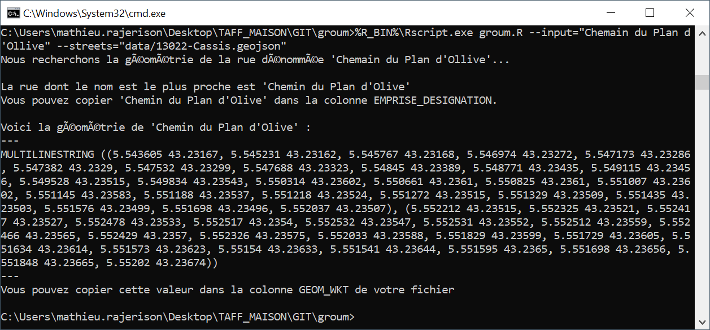
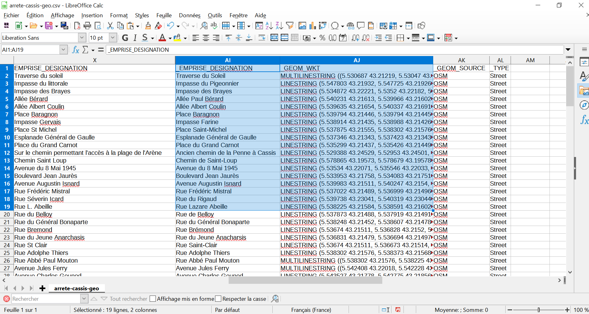
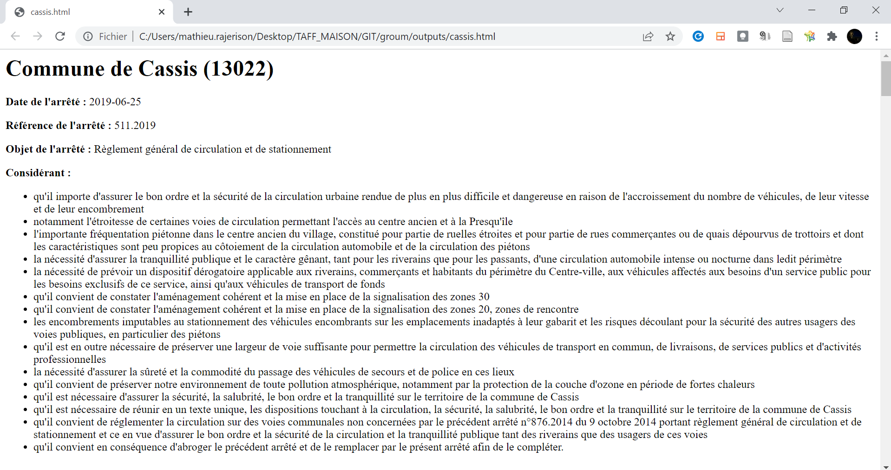
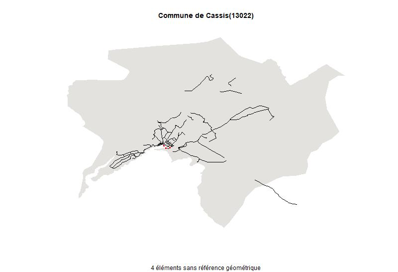
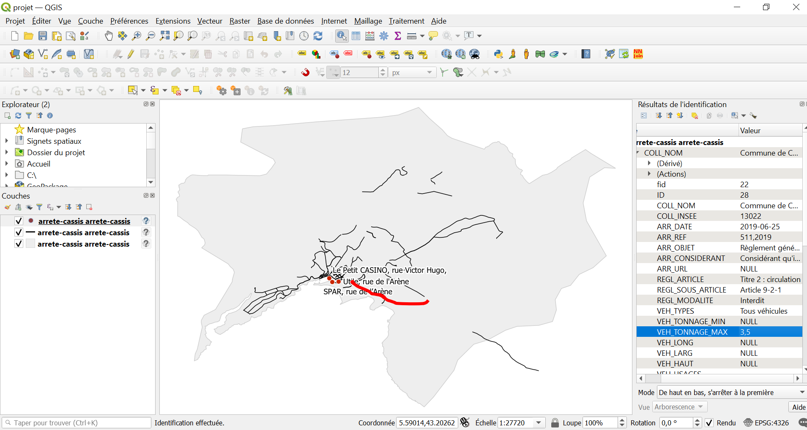

# groum

Outil en ligne de commande pour exploiter les données d'arrêtés de circulation permanents pour le transport de marchandises.

Il s'agit d'utilitaires associés au schéma [http://schema.data.gouv.fr/CEREMA/schema-arrete-circulation-marchandises/](http://schema.data.gouv.fr/CEREMA/schema-arrete-circulation-marchandises/)

`groum` permet de :

- Trouver la géométrie de rues ;
- Trouver la géométrie de communes ;
- Géocoder un fichier d'arrêtés, à savoir trouver la géométrie des rues qui le composent ;
- Convertir un fichier d'arrêtés CSV en HTML ;
- Convertir un fichier d'arrêtés CSV en Markdown

## Installation
[Installer et configurer `groum`](INSTALL.md)

## Trouver une rue
Dans l'exemple ci-dessous, on recherche `'Chemain du Plan d'Ollive'` (volontairement mal orthographiée) dans le fichier geojson `13022-Cassis.geojson` (d'autres formats : shp, gpkg, sont acceptés)

	%R_BIN%\Rscript.exe groum.R --input="Chemain du Plan d'Ollive" --streets="data/13022-Cassis.geojson"

Voici le résultat :

	>> La rue dont le nom est le plus proche est Chemin du Plan d'Olive
	MULTILINESTRING ((5.543605 43.23167, 5.545231 43.23162, 5.545767 43.23168, 5.546974 43.23272, 5.547173 43.23286, 5.547382 43.2329, 5.547532 43.23299, 5.547688 43.23323, 5.54845 43.23389, 5.548771 43.23435, 5.549115 43.23456, 5.549528 43.23515, 5.549834 43.23543, 5.550314 43.23602, 5.550661 43.2361, 5.550825 43.2361, 5.551007 43.23602, 5.551145 43.23583, 5.551188 43.23537, 5.551218 43.23524, 5.551272 43.23515, 5.551329 43.23509, 5.551435 43.23503, 5.551576 43.23499, 5.551698 43.23496, 5.552037 43.23507), (5.552212 43.23515, 5.552325 43.23521, 5.552417 43.23527, 5.552478 43.23533, 5.552517 43.2354, 5.552532 43.23547, 5.552531 43.23552, 5.552512 43.23559, 5.552466 43.23565, 5.552429 43.2357, 5.552326 43.23575, 5.552033 43.23588, 5.551829 43.23599, 5.551729 43.23605, 5.551634 43.23614, 5.551573 43.23623, 5.55154 43.23633, 5.551541 43.23644, 5.551595 43.2365, 5.551698 43.23656, 5.551848 43.23665, 5.55202 43.23674))

Voici le résultat dans l'invite de commandes :

## Trouver plusieurs rues
Ci-dessous, on recherche : 

- `'Chemain du Plan d'Ollive'`
- `'esplanade Charle de Gaule'`

dans le fichier `13022-Cassis.geojson`

	%R_BIN%\Rscript.exe groum.R --input="Chemain du Plan d'Ollive,esplanade Charle de Gaule" --streets="data/13022-Cassis.geojson"

## Trouver une commune

	%R_BIN%\Rscript.exe groum.R --input="Commune de Cassis"

> Pas besoin d'indiquer le fichier geojson car l'API geo.api.gouv.fr est utilisée

## Trouver un POI
En cours d'écriture...

## Géocoder le fichier d'arrêtés
Ci-dessous, on crée une version GeoCSV du fichier en ajoutant des colonnes géométriques au fichier initial

	%R_BIN%\Rscript.exe groum.R --input="data/arrete-cassis.csv" --output="outputs/arrete-cassis-geo.csv" --streets="data/13022-Cassis.geojson"

### Sortie
Le fichier `arrete-cassis-geo.csv` contiendra des colonnes supplémentaires dont `X_EMPRISE_DESIGNATION` avec le nom de la rue le plus similaire qui a été trouvé et `X_GEOM_WKT` avec la géométrie de la rue au format WKT.

## Générer l'arrêté
Ci-dessous, on génère l'arrêté depuis les données, sous une forme lisible au format HTML, ce qui permet de contrôler le résultat de la numérisation (adéquation à l'arrêté d'origine)

	%R_BIN%\Rscript.exe groum.R --input="data/arrete-cassis.csv" --output="outputs/arrete-cassis.html"

> La fonction de génération d'arrêté est encore à l'état expérimental. N'hésitez pas à [nous signaler des soucis](https://github.com/CEREMA/groum/issues).

## Générer l'arrêté en Markdown
Générer l'arrêté depuis les données, au format Markdown

	%R_BIN%\Rscript.exe groum.R --input="data/arrete-cassis.csv" --output="outputs/arrete-cassis.md"

## Créer une carte d'aperçu
On peut créer une image JPEG depuis le fichier de données d'arrêtés géocodé

	%R_BIN%\Rscript.exe groum.R --input="data/arrete-cassis-geo2.csv" --output="outputs/arrete-cassis.jpeg" --geom=X_GEOM_WKT

Voici le résultat :

## Créer les fichiers géographiques
Cette fonction crée le fichier spatial depuis le fichier de données d'arrêtés géocodé

	%R_BIN%\Rscript.exe groum.R --input="outputs/arrete-cassis-geo.csv" --output="outputs/arrete-cassis.gpkg" --geom=X_GEOM_WKT

> Il faut, ici, que la colonne `X_GEOM_WKT` comprenne la géométrie de chaque rue ou emprise au format WKT.

On peut afficher le résultat sous QGIS :

## Licence
- groum a été créé en Mars 2022
- Licence : [Licence Affero](LICENSE)  
- Auteur : Cerema > Mathieu Rajerison
